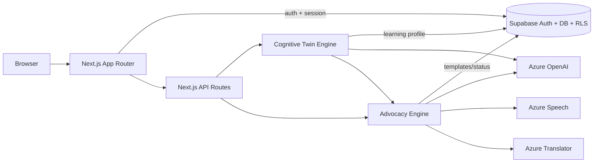

# Samvaad – Cognitive Twin for Learning & Advocacy

Samvaad builds a cognitive twin that learns how each user processes information and an advocacy engine that can communicate on their behalf. The system is engineered for accessibility, privacy, and measurable outcomes, with Azure AI and Supabase as core infrastructure.

## Core Capabilities
- Cognitive Twin Engine: captures learning signals and adapts explanations.
- Advocacy Engine: turns user intent into structured messages for calls/chats.
- Accessibility support: speech input/output, contrast controls, adjustable typography.
- Privacy controls: Supabase Row Level Security (RLS) and user-owned data deletion.

## System Architecture



### Component Boundaries
- Frontend (Next.js App Router): UI, accessibility controls, session handling.
- Backend APIs: route orchestration, validation, Supabase access.
- Cognitive Twin Engine: learning signal capture, prompt construction, adaptive responses.
- Advocacy Engine: template selection, context packaging, delivery formatting.
- Azure AI Services: OpenAI for reasoning, Speech for TTS/STT, Translator for multilingual support.
- Supabase: Auth, database with RLS enforcing per-user isolation.

## Architecture Flow

### User → Cognitive Twin Learning Loop
1. User interacts via dashboard or chat (Next.js).
2. API routes capture prompts, learning goals, and context.
3. Cognitive Twin Engine builds a structured prompt with user profile + history (from Supabase).
4. Azure OpenAI returns tailored explanations; results are stored back with RLS.
5. UI renders adapted guidance; optional Speech output stays client-side unless Azure Speech is configured.

### User → Advocacy → External Communication Loop
1. User selects an advocacy template or free-form request.
2. API routes call Advocacy Engine to shape tone, constraints, and target metadata.
3. Engine queries Azure OpenAI for message construction; Translator/Speech are invoked when enabled.
4. Final message is stored in Supabase with audit metadata; only user-owned rows are exposed.
5. UI presents ready-to-send text or speech for external channels the user controls.

### Data Flow and Privacy Boundaries
- Supabase RLS keeps user data tenant-scoped; API routes access only via authenticated sessions.
- Only minimal prompt context is sent to Azure services; secrets remain server-side.
- Speech features default to browser APIs; Azure Speech is opt-in for neural quality.

## Azure AI Usage Map

| Azure Service | Purpose | Input | Output | Why this service |
| --- | --- | --- | --- | --- |
| Azure OpenAI | Cognitive reasoning, adaptive tutoring, advocacy drafting | User goals, profile signals, conversation context | Personalized explanations or advocacy text | High-quality reasoning with controllable deployments and latency |
| Azure Speech | Text-to-speech / speech-to-text for accessibility | User microphone audio or generated text | Transcripts or neural speech | Reliable multilingual STT/TTS with edge caching options |
| Azure Translator | Multilingual learning and advocacy | Source text + target locale | Translated text | Built-in locale detection and enterprise compliance |

## Setup

Prerequisites: Node.js 18+, pnpm (or npm), Supabase project, Azure OpenAI credentials (for full AI features).

1. Install dependencies  
   ```bash
   pnpm install
   ```
2. Configure `.env.local`  
   ```env
   NEXT_PUBLIC_SUPABASE_URL=<supabase_url>
   NEXT_PUBLIC_SUPABASE_ANON_KEY=<supabase_anon_key>
   AZURE_OPENAI_ENDPOINT=<https://your-resource.openai.azure.com>
   AZURE_OPENAI_API_KEY=<key>
   AZURE_OPENAI_DEPLOYMENT=gpt-4
   AZURE_OPENAI_API_VERSION=2024-02-15-preview
   NEXT_PUBLIC_AZURE_SPEECH_KEY=<optional>
   NEXT_PUBLIC_AZURE_SPEECH_REGION=<optional>
   NEXT_PUBLIC_AZURE_TRANSLATOR_KEY=<optional>
   NEXT_PUBLIC_AZURE_TRANSLATOR_ENDPOINT=https://api.cognitive.microsofttranslator.com
   NEXT_PUBLIC_AZURE_TRANSLATOR_REGION=<optional>
   ```
3. Apply Supabase migration in `supabase/migrations/20250313212230_init.sql`.
4. Run locally  
   ```bash
   pnpm dev
   ```

## Tech Stack

- Next.js 15 (App Router), TypeScript, Tailwind CSS
- Supabase (PostgreSQL, Auth, RLS)
- Azure OpenAI, Azure Speech, Azure Translator
- Deployment targets: Vercel or any Node-compatible host

## Key Routes

| Route | Purpose |
| --- | --- |
| `/` | Landing |
| `/login` | Auth |
| `/dashboard` | Overview |
| `/dashboard/chat` | Cognitive twin + advocacy chat |
| `/dashboard/learning` | Learning analytics |
| `/dashboard/profile` | Preferences and accessibility |

## Why This Is Hard to Build
- Cognitive modeling requires capturing weak signals (pace, hesitations) and keeping prompts compact for latency.
- Real-time adaptation needs fast read/write against RLS while preserving session context.
- Advocacy must balance assertiveness, cultural tone, and compliance across channels.
- Accessibility demands speech, contrast, and motion controls without degrading performance.
- Privacy and trust require minimal data sent to Azure endpoints and auditable Supabase storage.

## Scalability & Future Work
- Multi-tenant cognitive twins with isolated Supabase schemas and shared Azure deployments.
- Real-time voice advocacy with streaming STT → reasoning → TTS loops.
- Fine-grained consent and audit trails per template and recipient.
- Enterprise and education rollout with SCIM/SAML, usage quotas, and localized content packs.

## Contributing
Pull requests are welcome; align changes with accessibility, privacy, and testing standards.

## License
MIT
